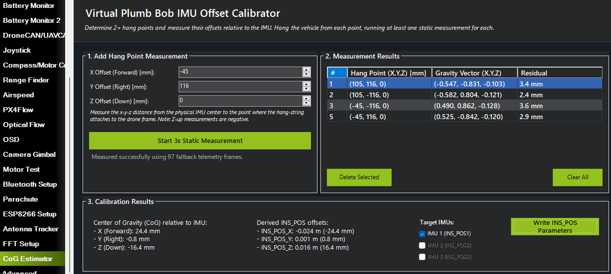

# Mission Planner CoG & IMU Offset Estimator Plugin

Estimates a vehicle's Center of Gravity (CoG) and [sensor position offsets (`INS_POS` parameters)](https://ardupilot.org/copter/docs/common-sensor-offset-compensation.html) using a 3D virtual plumb bob method.

## Method & Credits

This plugin utilizes an extension of the **Virtual Plumb Bob** method to estimate the intersection point of multiple suspension lines in 3D space. 

Credit for the original concept:
*   [Center-of-Gravity-PASCO-acceleromter-Matlab](https://github.com/johnwhear/Center-of-Gravity-PASCO-acceleromter-Matlab) by John Whear.
*   ArduPilot forum topic: [Novel Method to Find Center of Mass Using Accelerometer](https://discuss.ardupilot.org/t/novel-method-to-find-center-of-mass-using-accelerometer/144160/)

## Installation

1.  Locate your Mission Planner installation directory (typically `C:\Program Files (x86)\Mission Planner\`).
2.  Copy [CoGCalibratorPlugin.cs](CoGCalibratorPlugin.cs) into the `plugins/` directory of the Mission Planner installation.
3.  Restart Mission Planner. It will automatically compile and load the plugin at startup.

## Usage

### 1. Access the Interface
1.  Connect your autopilot to Mission Planner via telemetry or USB.
2.  Select the **SETUP** (Initial Setup) view at the top of the Mission Planner window.
3.  In the left navigation sidebar, expand the **Optional Hardware** menu.
4.  Click on **CoG Estimator**.

> NOTE: If connecting via USB, ensure that the cable does not overly interfere with the vehicle hanging free from the suspension point(s).

### 2. Record Measurements
To solve for the 3D Center of Gravity, you need to collect data from **at least 2** (ideally 3 or 4) different hang points. All batteries, payloads, etc, should be installed and secured before taking measurements.
1.  **Select a hang point** such as a motor mount or frame arm end.
2.  **Measure the hang point coordinates** in millimeters relative to the center of your physical IMU:
    *   **+X (Forward)**: hang point is forward of IMU
    *   **+Y (Right)**: hang point is to the right of IMU
    *   **-Z (Up)**: hang point is above the IMU (e.g. top plate/hang point is usually negative)
4.  **Suspend the vehicle** from a secure point and allow it to come to rest.
5.  **Input hang point coordinates** into the X, Y, and Z numeric input boxes.
6.  Click **Start 3s Static Measurement**. The vehicle should remain completely still until the progress bar completes.
7.  Repeat this process for different suspension points, tilting the vehicle at different angles.

### 3. Apply Offsets
1.  Verify the residuals in the recorded hang points table. If a measurement has a high residual (yellow/red), select it and click **Delete Selected**, then retake it.
2.  Select which IMUs to update (the checkboxes automatically reflect which IMU parameters are supported by your flight controller). Typically, you should select all enabled IMUs, as they are usually nearly co-located on the autopilot PCB.
3.  Click **Write INS_POS Parameters** to commit the offsets. Confirm the action in the pop-up warning dialog.
